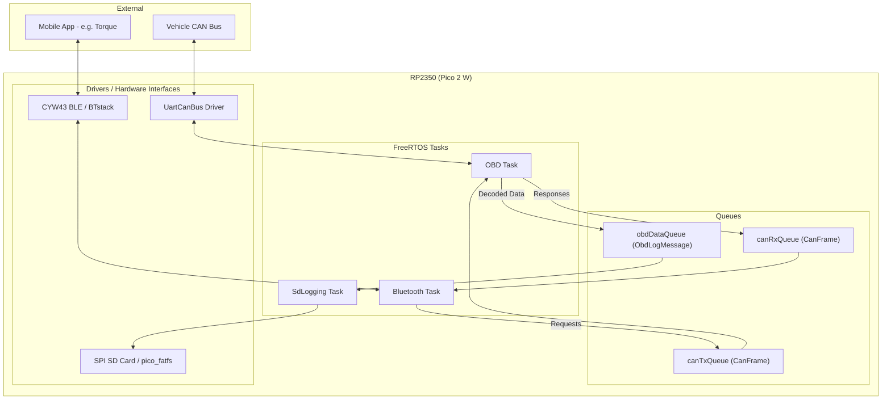

# OBDvg

### General Project Description

---
**OBDvg** is an embedded software project for a BMW F20 OBD gateway and logger, running on a **Raspberry Pi Pico 2 W** (RP2350). It interfaces with the vehicle's CAN bus and exposes data through Bluetooth Low Energy (BLE) using the ELM327 protocol while simultaneously logging decoded OBD-II parameters to an SD card.

#### Hardware List:
- **Raspberry Pi Pico 2 W** (RP2350)
- **Waveshare WS-TTL-CAN** (TTL UART to CAN Bus converter)
- **MH-SD Card Module** (SPI Interface)
- **Waveshare Buck Converter** (5.0V 4A)

*Testing hardware layout: breadboard with Pico 2 W (one for code, one for debugging), TTL-UART-to-CAN module, and OBD-II port.*

### Hardware Connectivity

---

#### 1. Waveshare WS-TTL-CAN (UART)
| Pico 2 W Pin | Function | CAN Module Pin |
|---|---|---|
| **GP4** | UART1 TX | RXD |
| **GP5** | UART1 RX | TXD |
| **GND** | Ground | GND |
| **3V3/5V** | Power | VCC |

#### 2. MH-SD Card Module (SPI)
| Pico 2 W Pin | Function | SD Module Pin |
|---|---|---|
| **GP18** | SPI0 SCK | SCK |
| **GP19** | SPI0 TX (MOSI) | MOSI |
| **GP16** | SPI0 RX (MISO) | MISO |
| **GP17** | SPI0 CS (Chip Select) | CS |
| **GND** | Ground | GND |
| **3V3/5V** | Power | VCC |

#### 3. OBD-II Cable Connectivity
| CAN Module Pin | Function | OBD-II Pin |
|---|---|---|
| **CANH** | CAN High | Pin 6 |
| **CANL** | CAN Low | Pin 14 |
| **GND** | Ground | Pin 4/5 |
| **VCC** | Battery Power | Pin 16 (Optional, if using 12V to 5V converter) |

### Software Description

---
The software is built on **FreeRTOS** and the **Raspberry Pi Pico SDK** using C++17. It utilizes a multi-tasking architecture with asynchronous inter-task communication via message queues.

#### Core Modules:
1.  **OBD Task:** Acts as the central hub. It manages the UART-to-CAN hardware, prioritizes outgoing requests from the phone, and routes incoming vehicle data to both the Bluetooth and SD Logging modules.
2.  **ELM327 Bluetooth Task:** Emulates an ELM327 interface over BLE. It translates standard OBD-II AT commands and PID requests into CAN frames and notifies the mobile app (e.g., Torque) when responses arrive.
3.  **SdLogging Task:** Decodes real-time vehicle parameters (RPM, Speed, Temps, etc.) and persists them to an SD card in CSV format using the `pico_fatfs` library.

#### Testing & Simulation:
The project includes a built-in **Simulator Mode** (enabled via `TEST_SIMULATOR_ENABLED` in `Config.h`). When active, the system simulates a vehicle connection, allowing for end-to-end testing of the BLE interface and SD logging without physical hardware.

### Architecture Diagram

### Build and Install

---
1.  Initialize submodules: `git submodule update --init --recursive`
2.  Create build directory: `mkdir build && cd build`
3.  Configure: `cmake ..`
4.  Build: `make -j4`
5.  Flash: Copy the resulting `obdvg.uf2` to the Pico in bootloader mode.
