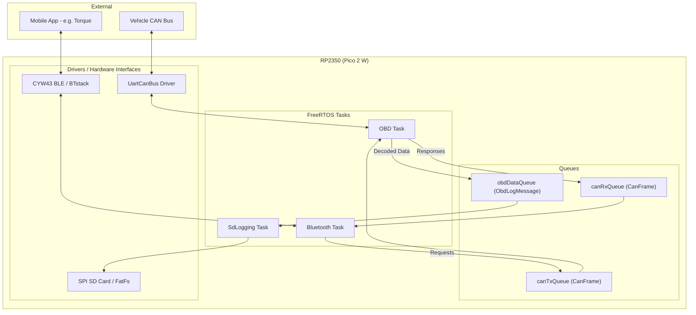

# OBDvg

### General Project Description

---
**OBDvg** is an embedded software project for a BMW F20 OBD gateway and logger, running on a **Raspberry Pi Pico 2 W** (RP2350). It interfaces with the vehicle's CAN bus and exposes data through Bluetooth using the ELM327 protocol while simultaneously logging data to an SD card.

#### Hardware List:
- **Raspberry Pi Pico 2 W** (RP2350)
- **Waveshare TTL UART to CAN** (CAN Bus interface)
- **SPI SD Card Module** (For local data logging)
- **Waveshare Buck Converter** (5.0V 4A)

### Software Description

---
The software is built on **FreeRTOS** and the **Raspberry Pi Pico SDK** using C++17. It utilizes a multi-tasking architecture with inter-task communication via message queues.

#### Core Modules:
1.  **OBD Task:** Manages the UART-to-CAN hardware, polls the vehicle for real-time PID data, and handles raw CAN frame traffic.
2.  **ELM327 Bluetooth Task:** Emulates an ELM327 interface over Bluetooth SPP (Serial Port Profile), allowing standard OBD-II apps (like Torque or Car Scanner) to communicate with the vehicle.
3.  **SD Logging Task:** Persists real-time vehicle data (RPM, Speed, Temps, etc.) to an SD card via SPI for later analysis.

### Architecture Diagram

### Build and Install

---
1.  Initialize submodules: `git submodule update --init --recursive`
2.  Create build directory: `mkdir build && cd build`
3.  Configure: `cmake ..`
4.  Build: `make -j4`
5.  Flash: Copy the resulting `obdvg.uf2` to the Pico in bootloader mode.
