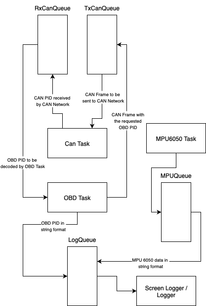

# OBDvg

### General Project Description

---
This is the software for an obd vent gauge. It is intented to be used in a BMW F20.

Hardware List:
- Raspberry pi pico 2 w
- Waveshare ttl Uart to Can
- MPU 6050 IMU
- Waveshare buck converter 5.0v 4Amp

### Software Description

---
The software implementation is based on freeRTOS and pico-sdk using c++.

There are 4 main tasks:
- OBD message task.
- ttl UART to CAN task.
- Screen Logger / Logger task.
- MPU 6060 data logger.

